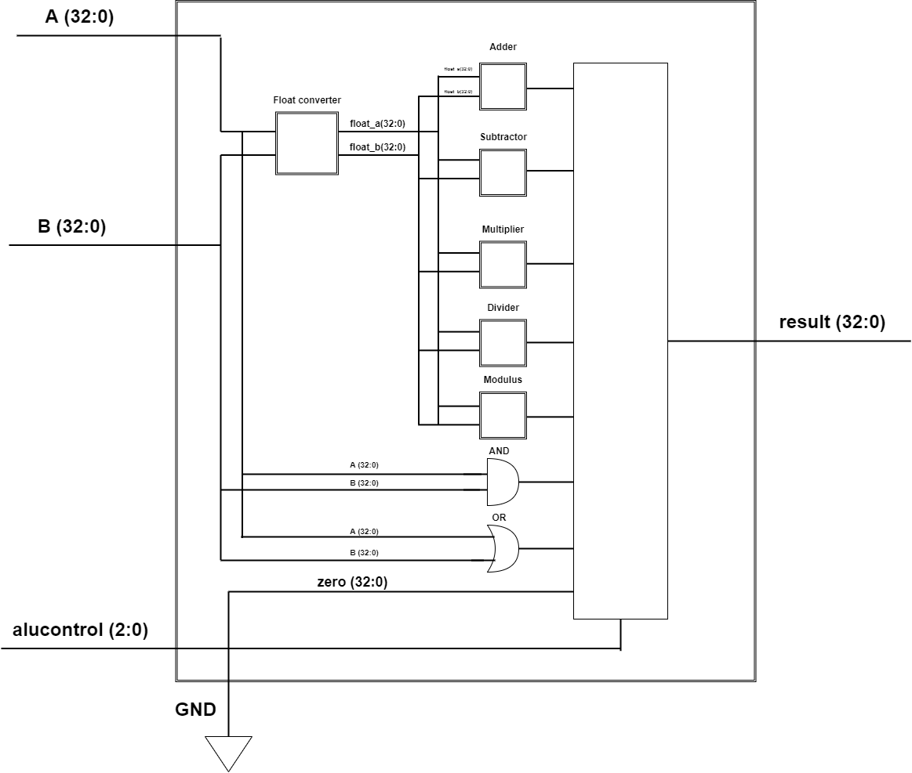

# CS401-1 Digital Design and Computer Architecture
## FP_2: DPU Design

# Introduction    
In this lab you will design the main *Data Path Unit* for your processor.  The Data Path Unit (DPU) is the core hardware of your machine that routes data flow to/from ALU(s) and registers of the processor.  The DPU also routes the instruction data from the instruction memory to the Control Unit (CU) as well as routing data from the registers, and immediate values that come with an instruction to the ALU(s). The results of the ALU(s) computations are then routed to either the main data memory or to other registers. Each of the components in the DPU must be individually tested and confirmed to be working before wiring them together, otherwise debugging the control unit will be much more difficult!

In this lab, your group will first design the final ALU for your processor and then, design the data path unit (i.e. the connections between the ALU, registers, and external memory).  This means that besides the ALU and the DPU, you will start thinking about how you want to implement the memory for your device.  

For now, it makes sense to keep the memory implementation on the FPGA because interfacing to an external memory can be complex. You may wish to include a port for an external input/output device, but your microprocessor should be able to function without this (just like the MIPS design was able to function without an external memory or I/O)  

# ALU Update or New Design
In the first part of this lab, you will design an ALU with operations to support your language. Here are some suggestions for ALU operation, however, you are not required to implement these if your processor does not require them: 

* shifters (shl, shr) 
* arithmetic (add, sub, mul, div) 
* comparison (lt, gt, lte, gte, eq) 
* bitwise logical operations (and, or, xor, inv, etc.) 
* special purpose operations? (Are you designing a special purpose processor?) 

Additionally, if you are going to have more than one "CORE" for supporting parallelism, you will want to keep the ALU as simple and lightweight as possible.  Remember that multiplication can actually be done in software with a shift/add algorithm if you need to make a super simple ALU.  

As you work on the DPU design, try to think about the future requirements. You will eventually add a control unit (in a future lab) and at a later point you will be required to add I/O capability to your processor. Start thinking about how you want the I/O to interface with your processor?  Do you want to have a dedicated I/O instruction or will your processor treat I/O like a memory location that reads/writes to specific memory addresses in order to do I/O? 

## What to Hand In
All of the following materials will be pushed to the __group repository__ that this readme is in on Whitgit. Make sure to work as a group and help one another contribute, teach each other the material as you work on it to help yourself learn it better as well. Work to include everyone!


*******************************************************************************
## Exercise 1: Update ALU or New ALU Desgin
*******************************************************************************
As a Group choose your ALU operations and then design your ALU.

* Given the language you designed in the previous project MP1, you will identify all the mathematical operations required by the ALU. Make a table of the chosen ALU operations with a description of each operation. Leave space for adding additional operations if needed. (See page 249 in your textbook for an example table) 

    *********************************************************************
    #### Alu Operations Table
    Complete the following table for the ALU operations in your processor:
    | ALU Control Bits| Function  |
    |:---------------:|:----------:
    |        000      |      addfi   |
    |        001      |       add    |
    |        010      |       sub    |
    |        011      |       mul    |
    |        100      |       div    |
    |        101      |       mod    |
    |        110      |       and    |
    |        111      |       or     |


    Fig 1. ALU Control Bits and Associated Function
    *********************************************************************

* Draw a neat, accurate, detailed hardware diagram of your ALU. I recommend doing this with an online Electronics CAD program or LTSpice. There are several free schematic tools available online, please create a professional looking hardware diagram for your ALU



    Fig 2: Diagram of our ALU

* Create the VHDL implementation for just the ALU. Be sure to comment your code adequately. Include your neatly formatted VHDL code for the ALU here: 

    ```vhdl
    ---------------------------------------------------------------
    -- Arithmetic/Logic unit with add/sub, AND, OR, set less than
    ---------------------------------------------------------------
    library IEEE; 
     -- these libraries give us basic float Arithmetic
    use IEEE.STD_LOGIC_1164.all; 
    use IEEE.STD_LOGIC_UNSIGNED.all;
        use IEEE.NUMERIC_STD.all;
    use IEEE.MATH_real.all;
    use work.fixed_float_types.all;
    use work.float_pkg.all;
    use work.fixed_pkg.all;

    --import floating point stuff

    entity alu is     -- define signals going in and out of the alu
      port(a, b:       in  STD_LOGIC_VECTOR(31 downto 0); --a and b are the two signals that are alu does an operation for
           alucontrol: in  STD_LOGIC_VECTOR(2 downto 0);  --this bit tells alu what operation we are performing 
           result:     out STD_LOGIC_VECTOR(31 downto 0)); --this is the result of the operation on a and b, sent out of alu
    end;

    architecture behave of alu is
        signal zero : STD_LOGIC_VECTOR(31 downto 0) := (others => '0'); --this is jsut constant 0 value, can make the result this if the opcode is undefinied for some reason
        signal float_a, float_b : UNRESOLVED_float(8 downto -23);          --used in converting the signals a and b to floats
    begin
        float_a <= to_float(a);   --converting the signals to floats
        float_b <= to_float(b);

      -- determine alu operation from alucontrol bits 0 and 1
      with alucontrol(2 downto 0) select result <=
        STD_LOGIC_VECTOR(float_a + float_b)     when "000",   --addfi
        STD_LOGIC_VECTOR(float_a + float_b)     when "001",   --add
        STD_LOGIC_VECTOR(float_a - float_b)     when "010",   --sub
        STD_LOGIC_VECTOR(float_a * float_b)     when "011",   --mul
        STD_LOGIC_VECTOR(float_a / float_b)     when "100",   --div
        STD_LOGIC_VECTOR(float_a mod float_b)   when "101",   --mod
        --these may never be used but wanted to have 8 ops
        a and b                 when "110",   --and
        a or b                  when "111",   --or
        zero                    when others;
    end;

    ```
    Fig 3: VHDL for the ALU

* Make a VHDL test bench to verify that the hardware for the new ALU design works. Be sure to comment your test bench code for your ALU adequately. Include your neatly formatted VHDL test bench code here: 

    ```vhdl
    library IEEE;
    use IEEE.std_logic_1164.all;
    use IEEE.STD_LOGIC_UNSIGNED.all;
    use IEEE.numeric_std.all;
    use IEEE.NUMERIC_STD.all;
    use IEEE.MATH_real.all;
    use work.fixed_float_types.all;
    use work.float_pkg.all;
    use work.fixed_pkg.all;

    entity alu_testbench is
    end;

    architecture alu_testbench of alu_testbench is 
        component alu is
            port(a, b: in STD_LOGIC_VECTOR(31 downto 0);
                alucontrol: in STD_LOGIC_VECTOR(2 downto 0);
                result: out STD_LOGIC_VECTOR(31 downto 0)
            );
        end component;
        signal sim_a, sim_b: STD_LOGIC_VECTOR(31 downto 0);
        signal sim_alucontrol: STD_LOGIC_VECTOR(2 downto 0);
        signal sim_result: STD_LOGIC_VECTOR(31 downto 0);
    begin 
        testproc: process begin
            wait for 10ns;
            sim_alucontrol <= "000"; -- addfi instruction
            sim_a <= std_logic_vector(to_float(4.5));
            sim_b <= std_logic_vector(to_float(3.2));
            wait for 10ns;
            assert sim_result = std_logic_vector(to_float(7.7)) report "Failed 4.5 addfi 3.2";

            sim_alucontrol <= "001"; -- add instruction, essentially same test as add: addfi and add do same computation
            sim_a <= std_logic_vector(to_float(-11));
            sim_b <= std_logic_vector(to_float(-48));
            wait for 10ns;
            assert sim_result = std_logic_vector(to_float(-59)) report "Failed -11 add -48";
            wait for 10ns; 
            
            sim_alucontrol <= "010"; -- sub instruction
            sim_a <= std_logic_vector(to_float(-11));
            sim_b <= std_logic_vector(to_float(22));
            wait for 10ns;
            assert sim_result = std_logic_vector(to_float(-33)) report "Failed -11 sub 22";
            wait for 10ns; 
            
            sim_alucontrol <= "011"; -- mul instruction
            sim_a <= std_logic_vector(to_float(-11.12));
            sim_b <= std_logic_vector(to_float(58.56));
            wait for 10ns;
            assert sim_result = std_logic_vector(to_float(-651.1872)) report "Failed -11.12 mul 58.56";
            wait for 10ns; 

            sim_alucontrol <= "100"; -- div instruction
            sim_a <= std_logic_vector(to_float(9974.54));
            sim_b <= std_logic_vector(to_float(3.45));
            wait for 10ns;
            assert sim_result = std_logic_vector(to_float(2891.171014)) report "Failed 9974.54 div 3.45";
            wait for 10ns; 

            sim_alucontrol <= "101"; -- mod instruction
            sim_a <= std_logic_vector(to_float(65));
            sim_b <= std_logic_vector(to_float(7.5));
            wait for 10ns;
            assert sim_result = std_logic_vector(to_float(5)) report "Failed 65 mul 7.5";
            wait for 10ns; 


        end process;

    sim_alu: alu port map(
            a => sim_a, 
            b => sim_b, 
            alucontrol => sim_alucontrol,
            result => sim_result
        );
    end alu_testbench;
    ```
    Fig 4: VHDL Test Bench for the ALU

*******************************************************************************
## Exercise 2: Data Path Unit Design
*******************************************************************************
In this exercise you will lay out your Data Path Unit, but you will NOT design the Control Unit yet. The best way to do this is like we illustrated in the lecture and powerpoint slides.

Start with your most complex instruction (e.g. if you have a memory load or memory store instruction.) Then, lay out the wires starting from the program counter to memory that looks up the instruction, to the registers, the ALUs, etc... lay out the wires and components needed to execute that first instruction.

Next, do the same for the next instruction. Will the instructions use the same data paths? Will you need to add multiplexers? What other components will you need?

Have your Assembly Language design easily accessible while you work on DPU/ALU design.  You will want to work on this as a group.

Again, start with the __most complex instructions__ and consider the following questions (this is not an exhaustive list of questions you should ask yourselves. This is to get you started...)

* What memory is required (i.e instruction, data, combined instruction/data) ? 
    instruction memory, data memory
* How does memory connect with/route to your registers? 
    there is a wire from memory to 
* How do registers connect with/route to your ALU? 
* How is immediate data routed?
* How does data get to the inputs of the ALU(s)>
* What multiplexers are required?
  
Following a process similar to what we followed from the book when it layed out the DPU/ALU for the MIPS lw/sw instructions, lay out the basic architecture of your machine. Look further below for where you will include your architecture diagram for your DPU.

In your group, discuss the following questions before you start on the DPU design: 

* Are you planning to create a Harvard architecture or a Von Neumann architecture? 
* Are you making a single cycle or multi-cycle processor? Why? (Multi-cycle is more challenging than single cycle to implement!)
* How will your program counter update? Will it reuse the ALU (hence you need a multi-cycle processor) or will you have a separate adder to update the program counter? 
* What about registers? What is your register naming scheme, and how many registers will you have? 
* Will your processor need to compute branch addresses or offset addresses? If so how will that be handled? 
* You will be required to add I/O your processor in the future, do you want memory mapped I/O (treat it like a memory address) or do you want a specific instructions that does I/O? 

### Data Path Unit Design in VHDL

Make all the components for the DPU using vhdl. Wire up the components using port maps (similar to how we did for MIPS). Include the vhdl component files in this repository folder. 

### Data Path Unit Design Schematic

Use Vivado to render your high level schematic. If you have used a modular design this should look ok. If it is too messy, you will need to do a manual schematic using a free online cad tool as you did earlier.

    Fig 5: Schematic of the DPU


*******************************************************************************
## Exercise 3: Design Walkthrough an FP_2 Mini Presentations
*******************************************************************************
On the due date for this design, groups will take 5-6 minutes (max) and present your DPU design to the class.  

* Minute 1: Does your new ALU design differ from previous designs (if so why, if not, why not)? Show a hardware diagram of your ALU. 
* Minute 2: Show a neat hardware diagram of your DPU and talk about your design.  
* Minute 3: Identify the control signals that your components will need. Will you need a FSM based Control Unit, or, will you need a multi-cycle control unit?
* Minutes 4-5: Summary. What went well? What not so well?  Did you do anything above and beyond the requirements (not required)?  What are you most proud of in your design?  

*******************************************************************************
## Exercise 4: Group Reflection (After Action Review or a Retrospective)
*******************************************************************************
After your group has presented your DPU to the class, as a group you should get together and discuss the following questions. Stick to facts, i.e. this is not about blame or praise, this is about decoding what happened and how the team worked (or didn't as the case may be) work together. It is not used for grading purposes or for praising/condeming participants. The goal is to identify truths about how the process went, and how to replicate strenghts in the future and how to mitigate weaknesses.  

In the real world, if you don't do this well your product may fail, and people will lose jobs, etc., Thus, this is a *very important part of the project!*. The purpose of this portion is not to critique OR to grade success or failure of one another. Rather, in this section, the purpose is to process and to identify weaknesses (in your project execution) that need improvement and strengths that might be sustained for the next parts of the project. (e.g. weaknesses - we waited till the last night before this was due... strengths - we collaborated well, listened well and had fun working together.)

* Purpose: "What did the group expect to happen in making FP_2?"
* Results: "What actually occurred as you worked on the DPU for FP_2?"
* Causes: "What caused the difference between the expectations and the results?"
* Implications: "What can our group learn from this to become stronger?"

Questions to Guide the Discussion. Take Notes.

1. Did the group achieve its goals?
2. If so, what factors allowed for this?
3. If not, what factors caused this?
4. What were the barriers present?
5. How can the group mitigate these barriers in the future?

### Summary of Observations
In this section, include your summary of the groups observations.

Purpose: In the making of fp_2, we expected the project to be intense because creating a datapath unit from scratch would be difficult.
We also weren't sure about the level of difficulty associated with floating point operations/numbers. We also knew that we would need to work consistently over the
week instead of doing it all at the last second.

Results: We had some issues getting the floating point library to compile with the project, but once that was done floating point operations worked well 
in both the ALU and the simulation for the ALU. The DPU was difficult as we expected. We finished the project reasonably, and ended up meeting multiple times to work on it.

Causes: Since we had a lack of knowledge about floating point operations/other various topics prior to starting the project, we didn't have many expectations. It's hard to say that anything specific
caused a difference in terms of our expectations vs reality. We would say that the learning process was the source of the difference between our expectations and what happened
(we needed to go through the learning process before we could have expectations).

Implications: We learned that you can use the syntax "work" to compile other vhdl libraries into our project. This will be very helpful moving forward for fp3 and fp4. We also learned a lot more about designing an ALU and DPU, and since 
we got hands-on experience with designing these components, our overall knowledge of both VHDL and general hardware design are improved. Also, knowing how our components work will be useful for the next projects.

1. Did the group acheive its goals?  
    Yes, we reasonably met our expectations for ourselves and the project.
    We are happy that we sucessfully got the floating point library to compile as well as simulating it correctly.
    Also, we are happy with our DPU design, and are excitied to see it working once we finish the control unit in the next project.

2. What factors allowed for this?   
    Nik's research on the IEEE floating point standard helped us a lot with identifying both the formats we wanted our data to be in as well as a compatible library we could use to convert our data to floats.
    Our flexibile schedules allowed us to meet frequently. 
    All of the group members put in a good effort on different components so that the work was spread evenly, which made our project a low stress environment.

3. What did not cause this?
    Nothing. We were successful.

4. What were the barriers present?
    Gettting floating point libraries to compile with the project.
    Designing the DPU, ALU
    Connecting all the components via the DPU

5. How can the group mitigate these barriers in the future.   
    Now that we know how to properly compile a library with our project, we will not run into compilation related issues again.
    Having a better understanding of our ALU/DPU will make it easier for us to refer back to old code if we ever need to work on a new/updated version of one.
    Connecting all of the components was a bit difficult, as it required a good understanding of how all of the components worked. Learning how all of the components work
    increases our understanding of the system as a whole and will make it easier to make new components in the future.


*******************************************************************************
### Grading Criteria
*******************************************************************************

 | CATEGORY | Poor or missing attempt | Beginning  | Satisfactory | Excellent  |
|:--------:|:--------:|:--------:|:--------:|:--------:|
| Exercise 1 (10 pts): New ALU Design |Missing or extremely poor quality.   |  No justification for the ALU design chosen, and simply copied the MIPS ALU without modification. Weak comments in the VHDL code. | Adequate justification of ALU design chosen.  Rudimentary testbench verifies some of the operations in the ALU. ALU hardware diagram adequate but could be better.   | Excellent ALU design. Excellent justifications given for both the design and the number of ALU operations implemented/ Neat professional ALU hardware diagram and neat tables. |
|Exercise 2: DPU Design  | Missing or extremely poor quality.  | Little thought given to questions about the DPU design. Messy hardware diagram. Missing control signals and signal names.  | Adequate hardware design. Some signals adequately documented.   | Excellent DPU design. Neat professional diagram (not hand drawn) Clear effort to consider all planned instruction data paths. Neatly documented control signals ready for control unit design in the next project. |
|Exercise 3: Design Walkthough  | Missing or extremely poor quality.  | Addressed some of the required items.   | Adequate address of the required items. Showed and discussed the hardware DPU design.  | Excellent presentation of both the ALU and the DPU. Clear consideration of tradeoffs in design. . |
|Exercise 4: Group Reflection After Action Review  | Missing or extremely poor quality.  | Poor discussion of the group dynamics. No ideas for how to mitigate issues raised. People had thin skins (easily upset) or thick skins (dont care about the fact there were serious issues in how the group functioned) | Adequate discussion of the group dynamics. Some thought given to how the group can work better in the future. Did one person do all the work? Did you all collaborate?    |Excellent discussion of group dynamics with clear suggestions for how your group will do better on the final two projects. How will you ensure that everyone gains an understanding of what is going on with the design? Good discussion of how the group manageed it’s time? Good discussion of what the group can do better?  |